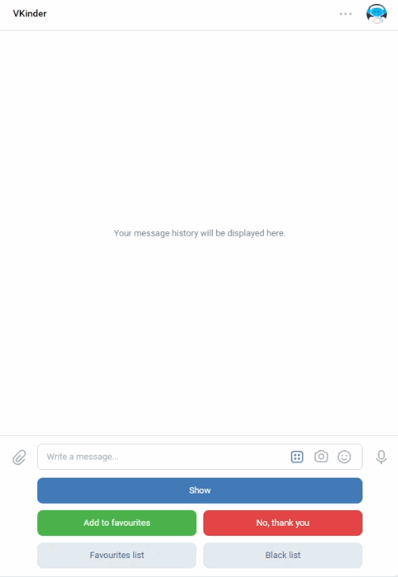

# [VKinder](https://vk.com/club219933818 "Сообщество VKinder") chatbot for VK App

### Goal

The goal is to make a script for a chatbot which interacts with a database of social media network VK. 
Bot offers different choices of random matches built as a dialogue with the user.

### Instructions

You need to write the program with the following conditions:
1. Using the information about the user of the bot (gender, age and city) find matching people.
2. For those matches you need to get three most popular pictures, which you can determine by the likes quantity.
3. Return the information about the matching profiles in the following format:

```
 First_name Last_name
 profile URL
 three pictures as an attachments (https://dev.vk.com/method/messages.send)
```

4. There should be a possibility to go to the next person, with the button or with a command.
5. Favourite matches can be saved to favourites list.
6. Return favourites list.

 ### How To:

1. Install requirements from `requirements.txt` with the following command `pip install -r requirements.txt`.
2. In `models.py`  change your PostgreSQL password, instead of YOURPASSWORD should be your unique password to create a database. 
For this bot PostgreSQL and PgAdmin were used. After that run the script models.py, so database will be created.
3. Create a community group in VK to get the token for chatbot (write it to file `settings.py`)
4. Create an app in VK to get the token for user (write it to `token.txt`) and other app settings data (write it to `settings.py` in corresponding fields).
5. Go to main.py and run the file.
6. To chat with the bot, follow the link [VKinder](https://vk.com/im?media=&sel=-219933818&v=)
7. To activate the bot write the message "hello".
8. Press button "Show" to pop new match. The results chosen according to algorithm from the initial task will be shown. Bot will choose profiles of the people opposite gender to yours, from the same city and the same age as a bot user. In case city information is missing, Moscow is used by default.
9. Press button "Add to favourites" to add profile to database table "FavouritesList". User have an option to review favourites list by pressing button "Favourites list".
10. When user presses the button "No, thank you" profile is added to database table black list. User have an option to review favourites list by pressing button "Black list".

### Result:

There were profiles in my blacklist and favourites list which I added while testing the App, that is the reason the bot shows everyone in those lists.



